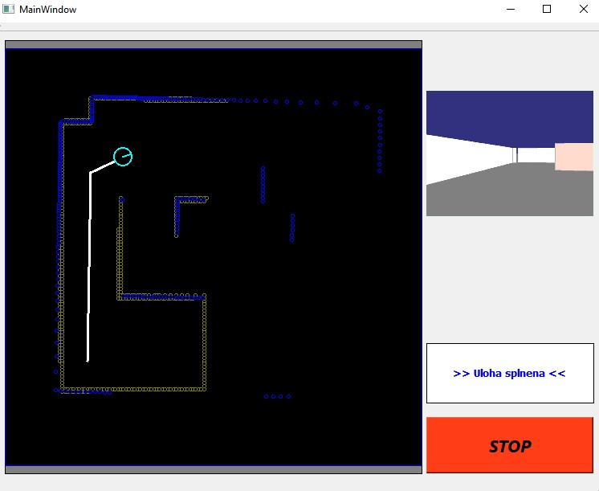
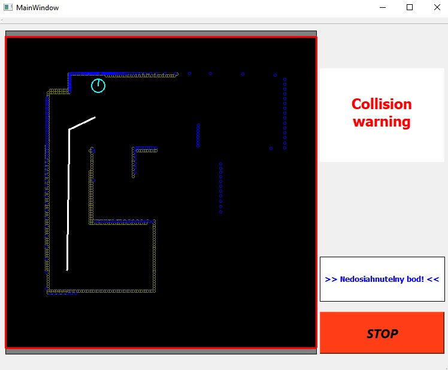
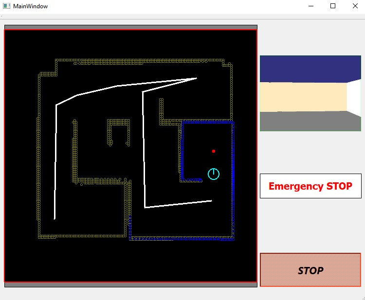

# Dokumentácia zadanie 2. HMI

## Opis úlohy:

Zadaním bolo navrhnúť používateľské rozhranie pre semi-autonómne riadenie mobilného robota typu Kobuki. Robot má za úlohu mapovať prostredie a zároveň byť schopný sa autonómne dostať na určenú pozíciu. Keďže medzi robotom a operátorom je dopravné oneskorenie, operátor len zadá príkaz kam sa má robot presunúť a celé riadenie vykoná robot sám.

## Používateľská dokumentácia:

Pre správne fungovanie programu je potrebné vopred spustiť:

- Kobuki simulátor
- Následne spustiť samotný program

Používateľské rozhranie sa skladá z:

- 75% mapa spolu s dátami z lidaru
- kamera o rozlíšení 4:3
- STOP tlačidlo pre núdzové zastavenie
- Priestor pre výpis aktuálnych informácií pre operátora

Môžeme to vidieť na nasledujúcom obrázku:

Na tomto obrázku taktiž vidíme, že robot aktuálne splnil úlohu a to, že dosiahol bod, ktorý mu zadal operátor kliknutím kdekoľvek do čierneho framu. Taktiež sú v tomto frame zvizualizované miesta, cez ktoré už robot prešiel a vyhlásil za splnené.

Taktiež je možné robotu zadať aj sériu bodov, ktorými mu operátor naplánuje celú trajektóriu pohybu.

V prípade, že operátor zadá pozíciu, ku ktorej sa robot nevie dostať, tak pred prekážkou zastane, prehlási tento bod za nesplniteľný, vycúva do bezpečnej zóny od prekážky a čaká na ďalšie pokyny. Taktiež sa na kamere objaví správa ,,Collision Warning" ako informácia pre operátora, že robot je veľmi blízko prekážky a hrozí kolízia.

STOP tlačidlo slúži pre núdzové zastavenie v prípade, že operátor potrebuje núdzovo dočasne prerušiť všetky úlohy. Takáto situácia je znázornená na nasledujúcom obrázku.

Úloha mapovanie sa vykonáva neustále počas behu programu, keď prídu nové dáta z lidaru sa mapa aktualizuje. Body, ktoré sú zaznamenané v mape ako prekážky sú znázornené žltou farbou a aktuálne prijaté dáta z lidaru sú znázornené modrou farbou.

